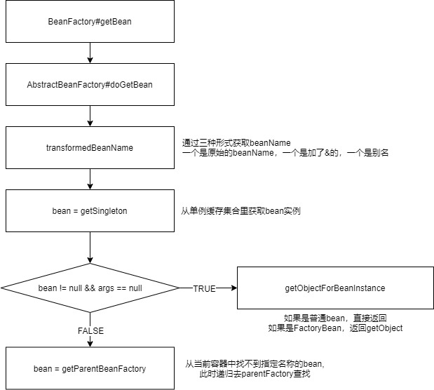

#  Spring Framework 5.2.5 源码 (个人学习使用)

# 编译

- 一定要通过git clone 下载, 直接下载的压缩文件 build 不通过
- idea 中要 unload 掉 spring-aspect 
- 先在命令行中编译 oxm 模块, ./gradlew :spring-oxm:compileTestJava`

# 创建 spring-demo 模块

include 'spring-demo'  得放在 settings.gradle 文件最后,不然无法build通过

# Spring IOC 容器加载过程

配置文件到读取 Resource, 解析为 BeanDefinition, 注册到容器中

# Spring MVC 核心流程

建立请求 和 Controller 方法的映射集合的流程

根据请求查询对应的 Controller 方法的流程

请求参数绑定到方法形参,执行方法处理请求, 渲染视图的流程
